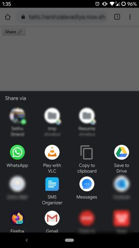
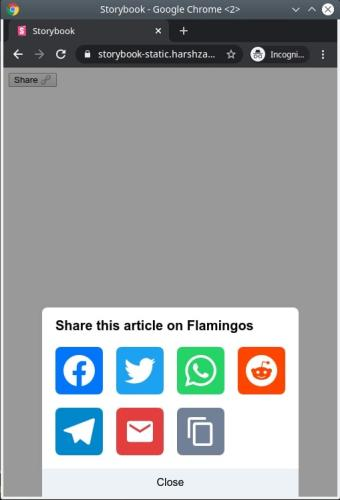

# react-web-share

Tiny [Web Share API](https://developer.mozilla.org/en-US/docs/Web/API/Navigator/share) wrapper with fallback for unsupported browsers

[](https://github.com/harshzalavadiya/react-web-share/actions)
[](https://npm.im/react-web-share)
[](https://bundlephobia.com/result?p=react-web-share@latest)

[](https://codesandbox.io/s/react-web-share-46skt?fontsize=14&hidenavigation=1&theme=dark)

> 💡 most browsers restricts web share api only to https websites

## ✨ Features

- 🍃 Only ~3kb gzipped and no external dependencies
- 🌀 Uses React Portal
- ✌ Written w/ TypeScript

## 🔧 Installation

```bash
npm i react-web-share    # npm
yarn add react-web-share # yarn
```

## Preview

### Mobile



### Desktop



## 📦 Example

```tsx
import React, { useState } from "react";
import { RWebShare } from "react-web-share";

const Example = () => {
  return (
    <div>
      <RWebShare
        data={{
          text: "Like humans, flamingos make friends for life",
          url: "https://on.natgeo.com/2zHaNup",
          title: "Flamingos",
        }}
      >
        <button>Share 🔗</button>
      </RWebShare>
    </div>
  );
};

export default Example;
```

## 👀 Props

| Prop    | Description  | Type                 | Default                                       |
| ------- | ------------ | -------------------- | --------------------------------------------- |
| `data`  | Share Object | `{text, url, title}` | `{text: "", url: currentURL, title: "Share"}` |
| `sites` | sites        | `string[]`           | all platforms (see list below for key list)   |

## 🌎 Sites

- facebook
- twitter
- whatsapp
- reddit
- telegram
- linkedin
- mail
- copy (Copy to Clipboard)

## 🤠 Credits

- [TypeScript](https://github.com/microsoft/typescript)
- [TSDX](https://github.com/jaredpalmer/tsdx)

## 📜 License

MIT &copy; [harshzalavadiya](https://github.com/harshzalavadiya)
